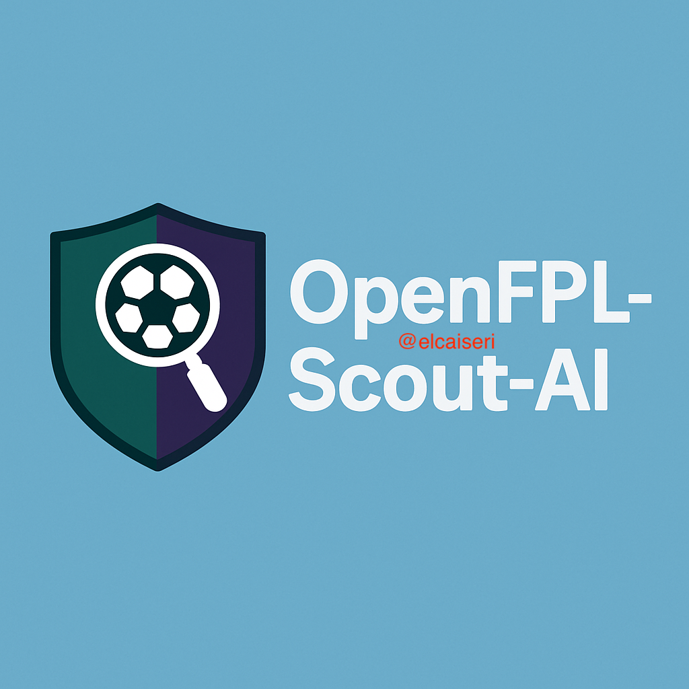
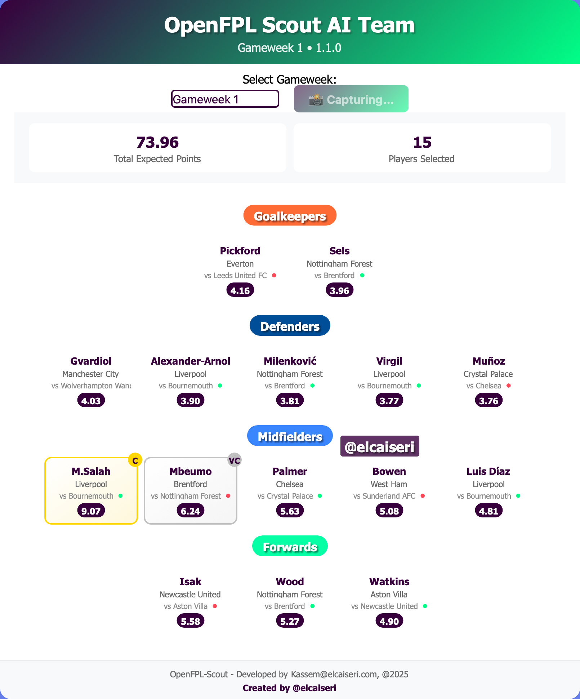

# OpenFPL-Scout-AI



*Image credits: Generated with GPT-4o*

OpenFPL-Scout-AI is an AI-powered Fantasy Premier League Scout that uses ensemble machine learning (Linear Regression, XGBoost, CatBoost) to predict player points and optimize FPL team selection. It features a beautiful web interface for visualizing your optimal team in a football pitch layout.

## 🚀 Live Demo & API Access

**Web Interface:** **[https://openfpl-scout-ai-186049008266.europe-west1.run.app](https://openfpl-scout-ai-186049008266.europe-west1.run.app)**

**🔥 API Access via RapidAPI:** **[Subscribe on RapidAPI Marketplace](https://rapidapi.com/elcaiseri-elcaiseri-default/api/openfpl-api)** 
- Free tier: 10 requests/hour
- Professional support and documentation
- Easy integration with RapidAPI headers

## Features

- 🎯 **AI-Powered Predictions**: Ensemble ML models (Linear Regression, XGBoost, CatBoost)
- ⚽ **Interactive Web UI**: Beautiful pitch visualization with player cards
- 📊 **Real-time Data**: Live fixture and match data integration
- 🚀 **Fast Performance**: Async player predictions and caching
- 🏆 **Smart Team Selection**: Automated optimal team selection by position
- 👑 **Captain Assignment**: Intelligent captain/vice-captain selection
- 📱 **Mobile Responsive**: Works perfectly on all devices
- 📸 **Screenshot Feature**: Download your team lineup as PNG
- 🎨 **Professional Design**: FPL-themed UI with gradient backgrounds
- 🔌 **RapidAPI Integration**: Professional API marketplace access

## Installation

**Docker:**
```bash
docker build -t openfpl-scout-ai .
docker run -d -p 8000:8000 --name openfpl-api openfpl-scout-ai
```

## Usage

### Web Interface
Visit the [live demo](https://openfpl-scout-ai-186049008266.europe-west1.run.app) or [http://localhost:8000](http://localhost:8000) for local development:

- **Visual Team Display**: See your optimal team laid out on a football pitch
- **Player Cards**: Detailed cards showing player stats, fixtures, and expected points
- **Gameweek Selection**: Navigate between different gameweeks
- **Screenshot Export**: Download your team lineup as a high-quality image
- **Interactive Elements**: Click on player cards for detailed information

### API Access via RapidAPI

**🔥 Primary API Access:** [Subscribe on RapidAPI Marketplace](https://rapidapi.com/elcaiseri-elcaiseri-default/api/openfpl-api)

**Base URL:** `https://openfpl-api.p.rapidapi.com`

**Authentication:**
```http
X-RapidAPI-Key: YOUR_RAPIDAPI_KEY
X-RapidAPI-Host: openfpl-api.p.rapidapi.com
```

**Quick Example:**
```javascript
const options = {
    method: 'GET',
    headers: {
        'X-RapidAPI-Key': 'YOUR_RAPIDAPI_KEY',
        'X-RapidAPI-Host': 'openfpl-api.p.rapidapi.com'
    }
};

fetch('https://openfpl-api.p.rapidapi.com/api/gw/scout?gameweek=7', options)
    .then(response => response.json())
    .then(data => console.log(data));
```

### API Documentation
- **RapidAPI Docs:** [https://rapidapi.com/elcaiseri-elcaiseri-default/api/openfpl-api](https://rapidapi.com/elcaiseri-elcaiseri-default/api/openfpl-api)

### Main Endpoints

- `GET /api/health` — Health check
- `GET /api/gameweeks` — Available gameweeks with saved data
- `GET /api/gw/scout` — Get optimal FPL team for specific gameweek
- `GET /api/gw/playerpoints` — Get filtered player point predictions
- `GET /api` — API information and metadata

**Sample `/api/gw/scout` response:**
```json
{
  "scout_team": [
    {
      "element_type": "Goalkeeper",
      "web_name": "Alisson",
      "team_name": "Liverpool",
      "expected_points": 5.2,
      "role": "",
      "now_cost": 55,
      "selected_by_percent": 15.5
    },
    {
      "element_type": "Defender",
      "web_name": "Alexander-Arnold",
      "team_name": "Liverpool",
      "expected_points": 8.1,
      "role": "captain",
      "now_cost": 70,
      "selected_by_percent": 45.2
    }
  ],
  "gameweek": 7,
  "version": "4.0.0",
  "credits": "OpenFPL-Scout AI - Team Predictions | Developed by Kassem @elcaiseri, 2025"
}
```

## Screenshots

The web interface provides a beautiful visualization of your optimal FPL team:



Features of the UI:
- **Football Pitch Layout**: Players arranged in realistic formation
- **Color-Coded Positions**: Goalkeepers (Orange), Defenders (Blue), Midfielders (Light Blue), Forwards (Green)
- **Captain Badges**: Golden 'C' for captain, Silver 'VC' for vice-captain
- **Fixture Information**: Opponent teams and home/away indicators
- **Expected Points**: AI-predicted points for each player
- **Team Statistics**: Total expected points and player count
- **Responsive Design**: Works on desktop, tablet, and mobile devices

## Model Overview

| Model             | Version | Description                    |
|-------------------|---------|--------------------------------|
| Linear Regression | v2.0    | Baseline linear model          |
| XGBoost           | v2.0    | Gradient boosting ensemble     |
| CatBoost          | v1.0    | Categorical boosting model     |

- Ensemble predictions for accuracy
- Feature importance analysis
- Optimized for FPL player performance

## API Integration

Integrates with Football Data API for:
- Live fixtures and matchups
- Home/away status
- Gameweek info

**For RapidAPI Users:** All data is pre-processed and cached for optimal performance.

## Code Structure

- `main.py`: FastAPI app and endpoints
- `src/scout.py`: FPLScout class (predictions, team selection)
- `src/models.py`: Pydantic response models
- `src/utils.py`: Config and helpers
- `src/logger.py`: Logging

## What's New

- **🔌 RapidAPI Marketplace**: Now available on RapidAPI with professional support
- **📈 Enhanced API**: New endpoints for gameweeks and player filtering
- **🌐 Live Deployment**: Available on Google Cloud Platform
- **🎨 Beautiful Web Interface**: Interactive team visualization with football pitch layout
- **📸 Screenshot Feature**: Export your team lineup as high-quality PNG images
- **📱 Mobile Responsive**: Perfect experience on all devices
- **2024/2025 Season**: Models updated with latest data
- **CatBoost Integration**: Improved ML pipeline ([Issue #1](https://github.com/elcaiseri/Fantasy-Premier-League-LTX/issues/1))
- **RESTful API**: FastAPI endpoints for team selection and predictions
- **Rebranding**: Now OpenFPL-Scout-AI
- **Refactored Code**: Improved modularity and maintainability
- **AI-Powered Predictions**: Advanced ensemble models
- **Async Processing**: Fast parallel predictions
- **Live Data**: Real-time match integration
- **Docker Support**: Easy deployment

## Contributing

Contributions welcome! Ideas for improvement:
- Enhanced algorithms and selection logic
- Additional UI features and visualizations
- Player injury/form tracking
- Better documentation
- Mobile app development

Fork, branch, and submit a pull request.

## License

MIT License — see [LICENSE](LICENSE) for details.

## API Support & Contact

**For API Support:**
- **RapidAPI Marketplace:** [https://rapidapi.com/elcaiseri-elcaiseri-default/api/openfpl-api](https://rapidapi.com/elcaiseri-elcaiseri-default/api/openfpl-api)
- **Email:** [support@openfpl.kassem.dev](mailto:iqasem4444@gmail.com)

**General Questions:**
- **Email:** [iqasem4444@gmail.com](mailto:iqasem4444@gmail.com)
