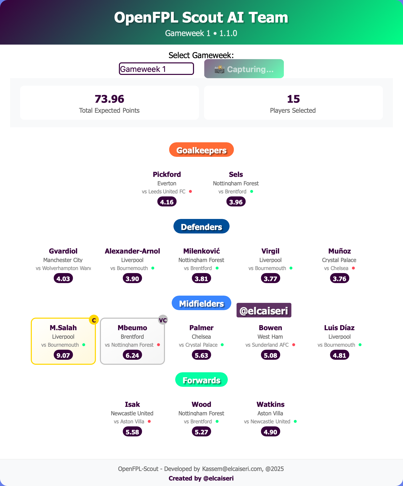

# OpenFPL-Scout-AI


*OpenFPL 2026/27 icon generated with OpenAI image generation.*

OpenFPL-Scout-AI is an AI-powered Fantasy Premier League Scout that uses Ridge, XGBoost, CatBoost, and MLP models to predict player points and optimize FPL team selection. All runtime player, club, gameweek, and fixture data comes directly from the official Fantasy Premier League API.

## 🚀 Live Demo & API Access

**Web Interface:** **[https://openfpl-scout-ai-186049008266.europe-west1.run.app](https://openfpl-scout-ai-186049008266.europe-west1.run.app)**

**🔥 API Access via RapidAPI:** **[Subscribe on RapidAPI Marketplace](https://rapidapi.com/elcaiseri-elcaiseri-default/api/openfpl-api)** 
- Free tier: 10 requests/hour
- Professional support and documentation
- Easy integration with RapidAPI headers

## Features

- 🎯 **AI-Powered Predictions**: Ensemble ML models (Ridge, XGBoost, CatBoost, MLP)
- ⚽ **Interactive Web UI**: Beautiful pitch visualization with player cards
- 📊 **Official FPL Data**: Live players, histories, fixtures, and event state
- 🚀 **Fast Performance**: Async player predictions and caching
- 🏆 **Smart Team Selection**: Automated optimal team selection by position
- 👑 **Captain Assignment**: Intelligent captain/vice-captain selection
- 📱 **Mobile Responsive**: Works perfectly on all devices
- 📸 **Screenshot Feature**: Download your team lineup as PNG
- 🎨 **Professional Design**: FPL-themed UI with gradient backgrounds
- 🔌 **RapidAPI Integration**: Professional API marketplace access

## Installation

**Docker:**
```bash
docker build -t openfpl-scout-ai .
docker run -d -p 8000:8000 --name openfpl-api openfpl-scout-ai
```

## Usage

### Web Interface
Visit the [live demo](https://openfpl-scout-ai-186049008266.europe-west1.run.app) or [http://localhost:8000](http://localhost:8000) for local development:

- **Visual Team Display**: See your optimal team laid out on a football pitch
- **Player Cards**: Detailed cards showing player stats, fixtures, and expected points
- **Gameweek Selection**: Navigate between different gameweeks
- **Screenshot Export**: Download your team lineup as a high-quality image
- **Interactive Elements**: Click on player cards for detailed information

### API Access via RapidAPI

**🔥 Primary API Access:** [Subscribe on RapidAPI Marketplace](https://rapidapi.com/elcaiseri-elcaiseri-default/api/openfpl-api)

**Base URL:** `https://openfpl-api.p.rapidapi.com`

**Authentication:**
```http
X-RapidAPI-Key: YOUR_RAPIDAPI_KEY
X-RapidAPI-Host: openfpl-api.p.rapidapi.com
```

**Quick Example:**
```javascript
const options = {
    method: 'GET',
    headers: {
        'X-RapidAPI-Key': 'YOUR_RAPIDAPI_KEY',
        'X-RapidAPI-Host': 'openfpl-api.p.rapidapi.com'
    }
};

fetch('https://openfpl-api.p.rapidapi.com/api/gw/scout?gameweek=7', options)
    .then(response => response.json())
    .then(data => console.log(data));
```

### API Documentation
- **RapidAPI Docs:** [https://rapidapi.com/elcaiseri-elcaiseri-default/api/openfpl-api](https://rapidapi.com/elcaiseri-elcaiseri-default/api/openfpl-api)

### Main Endpoints

Production API documentation is available through ReDoc at `/redoc`; local
development also exposes Swagger at `/docs`. `GET /api` returns the complete
route catalog grouped by tag.

| Tag | Endpoints |
|---|---|
| Service | `GET /api`, `GET /api/health` |
| Official FPL · Gameweeks | Events, status, live scoring, and dream teams |
| Official FPL · Teams | `GET /api/fpl/teams` |
| Official FPL · Players | Player collection, details, and history |
| Official FPL · Fixtures | Fixture collection and per-fixture statistics |
| Official FPL · Managers | Public profiles, history, transfers, and picks |
| Official FPL · Leagues & Cups | Classic/H2H standings, H2H matches, and cup state |
| Official FPL · Reference & Rankings | Regions, set pieces, rankings, and winners |
| Scout AI | `GET/POST /api/scout`, `GET /api/gw/scout`, `GET /api/gw/playerpoints` |

Mapped player queries include availability, name, price, sorting, and pagination
options. Fixtures include gameweek, club, future, and finished filters. See the
[Official FPL API Kit](Official-FPL-API-Kit.md) for the full audited route map
and every option, or [Docs.md](Docs.md) for authentication and response details.
- `GET /api` — API information and metadata

**Sample `/api/gw/scout` response:**
```json
{
  "scout_team": [
    {
      "element_type": "Goalkeeper",
      "web_name": "Alisson",
      "team_name": "Liverpool",
      "expected_points": 5.2,
      "role": "",
      "now_cost": 55,
      "selected_by_percent": 15.5
    },
    {
      "element_type": "Defender",
      "web_name": "Alexander-Arnold",
      "team_name": "Liverpool",
      "expected_points": 8.1,
      "role": "captain",
      "now_cost": 70,
      "selected_by_percent": 45.2
    }
  ],
  "gameweek": 7,
  "version": "5.3.0",
  "source": "official-fpl",
  "credits": "OpenFPL Scout AI | Official FPL data | @elcaiseri, 2026"
}
```

## Screenshots

The web interface provides a beautiful visualization of your optimal FPL team:



Features of the UI:
- **Football Pitch Layout**: Players arranged in realistic formation
- **Color-Coded Positions**: Goalkeepers (Orange), Defenders (Blue), Midfielders (Light Blue), Forwards (Green)
- **Captain Badges**: Golden 'C' for captain, Silver 'VC' for vice-captain
- **Fixture Information**: Opponent teams and home/away indicators
- **Expected Points**: AI-predicted points for each player
- **Team Statistics**: Total expected points and player count
- **Responsive Design**: Works on desktop, tablet, and mobile devices

## Model Overview

| Model             | Version | Description                    |
|-------------------|---------|--------------------------------|
| Ridge Regression  | v6.0    | Regularized linear baseline    |
| XGBoost           | v6.0    | Gradient boosting ensemble     |
| CatBoost          | v6.0    | Categorical boosting model     |
| MLP                | v2.0    | Neural-network regressor       |

Training uses leakage-safe 3/5/10-match form, volatility, recent minutes,
appearance/start probabilities, and fixture context. Player names are retained
for API output but are not model inputs. Tuning uses expanding chronological
folds on development seasons, followed by one evaluation on the untouched
latest season. To retrain all deployment models and record metrics:

```bash
uv run --group train python trainer-booster.py \
  --data-dir data/official \
  --output-dir models \
  --folds 5 \
  --tune
```

The run writes each complete preprocessing/model pipeline plus CV and tuning
summaries, baseline comparisons, row-level OOF predictions, untouched-holdout
results and predictions, optimized ensemble weights, metadata, and an
append-only training history. The latest archived season is the holdout by
default; use `--holdout-season YEAR` to state it explicitly and `--quick` for a
fast smoke test.

At startup, the inference engine validates each saved model against the shared
feature contract. Runtime inference uses player IDs, caches fixture lookups,
supports per-model weights, and can continue when one model fails as long as
`inference.minimum_successful_models` is satisfied.

Runtime requests never read the local training CSVs. Before GW1, when official
match history is empty, history features remain unknown and are handled by the
imputers fitted inside each saved model pipeline.

- Ensemble predictions for accuracy
- Season-forward validation metrics
- Optimized for FPL player performance

## API Integration

Integrates directly with official FPL endpoints for:
- Bootstrap players, teams, positions, and gameweek state
- Player gameweek history and official FPL statistics
- Fixtures, kickoff times, difficulty, and home/away status
- Live scoring, manager history, public picks, transfers, leagues, and cups
- Regions, set-piece notes, rankings, event winners, and phase winners

No football-data.org API key or uploaded statistics file is required. The
official FPL API does not provide a stable versioned historical archive, so
new official match history must be collected during each active season.

Archive the active official season for future retraining with:

```bash
uv run python -m scripts.collect_official_fpl --gameweek 39
```

The collector writes to `data/official` by default, which is also the default
source for the cross-validated trainer. Legacy files under `data/external` are
not used by the runtime or by the default retraining command.

### Temporary FPL Data import

While written reuse permission is pending, one historical CSV can be fetched
through the public **Download CSV** control on
[FPL Data](https://www.fpl-data.co.uk/statistics):

```bash
uv run python -m scripts.download_fpl_data \
  --season latest \
  --acknowledge-permission-pending
```

The importer makes one download request for the selected season, validates the
CSV structure and core values, reports coverage of the 17 non-official model
features, and writes both the dataset and provenance metadata atomically under
`data/external`. Existing data is not changed unless `--replace` is supplied;
lower gameweek or feature coverage is still rejected unless
`--allow-regression` is also explicitly supplied.

For a later guarded refresh of the same season, use:

```bash
uv run python -m scripts.download_fpl_data \
  --season latest \
  --replace \
  --acknowledge-permission-pending
```

This source is intentionally isolated from runtime inference and the default
training path. Do not redistribute it, train a commercial release from it, or
schedule unattended downloads until the data owner grants permission. List
the seasons currently offered by the page with:

```bash
uv run python -m scripts.download_fpl_data --list-seasons
```

**For RapidAPI Users:** All data is pre-processed and cached for optimal performance.

## Code Structure

- `main.py`: FastAPI app and endpoints
- `src/scout.py`: FPLScout class (predictions, team selection)
- `src/features.py`: Shared training and inference feature contract
- `src/official_fpl.py`: Official FPL API client and schema adapter
- `src/models.py`: Pydantic response models
- `src/utils.py`: Config and helpers
- `src/logger.py`: Logging

## What's New

- **🔌 RapidAPI Marketplace**: Now available on RapidAPI with professional support
- **📈 Enhanced API**: New endpoints for gameweeks and player filtering
- **🌐 Live Deployment**: Available on Google Cloud Platform
- **🎨 Beautiful Web Interface**: Interactive team visualization with football pitch layout
- **📸 Screenshot Feature**: Export your team lineup as high-quality PNG images
- **📱 Mobile Responsive**: Perfect experience on all devices
- **2026/2027 Season**: Models and UI updated for the new season
- **CatBoost Integration**: Improved ML pipeline ([Issue #1](https://github.com/elcaiseri/Fantasy-Premier-League-LTX/issues/1))
- **RESTful API**: FastAPI endpoints for team selection and predictions
- **Rebranding**: Now OpenFPL-Scout-AI
- **Refactored Code**: Improved modularity and maintainability
- **AI-Powered Predictions**: Advanced ensemble models, including an MLP
- **Async Processing**: Fast parallel predictions
- **Live Data**: Real-time match integration
- **Docker Support**: Easy deployment

## Contributing

Contributions welcome! Ideas for improvement:
- Enhanced algorithms and selection logic
- Additional UI features and visualizations
- Player injury/form tracking
- Better documentation
- Mobile app development

Fork, branch, and submit a pull request.

## License

MIT License — see [LICENSE](LICENSE) for details.

## API Support & Contact

**For API Support:**
- **RapidAPI Marketplace:** [https://rapidapi.com/elcaiseri-elcaiseri-default/api/openfpl-api](https://rapidapi.com/elcaiseri-elcaiseri-default/api/openfpl-api)
- **Email:** [support@openfpl.kassem.dev](mailto:iqasem4444@gmail.com)

**General Questions:**
- **Email:** [iqasem4444@gmail.com](mailto:iqasem4444@gmail.com)
