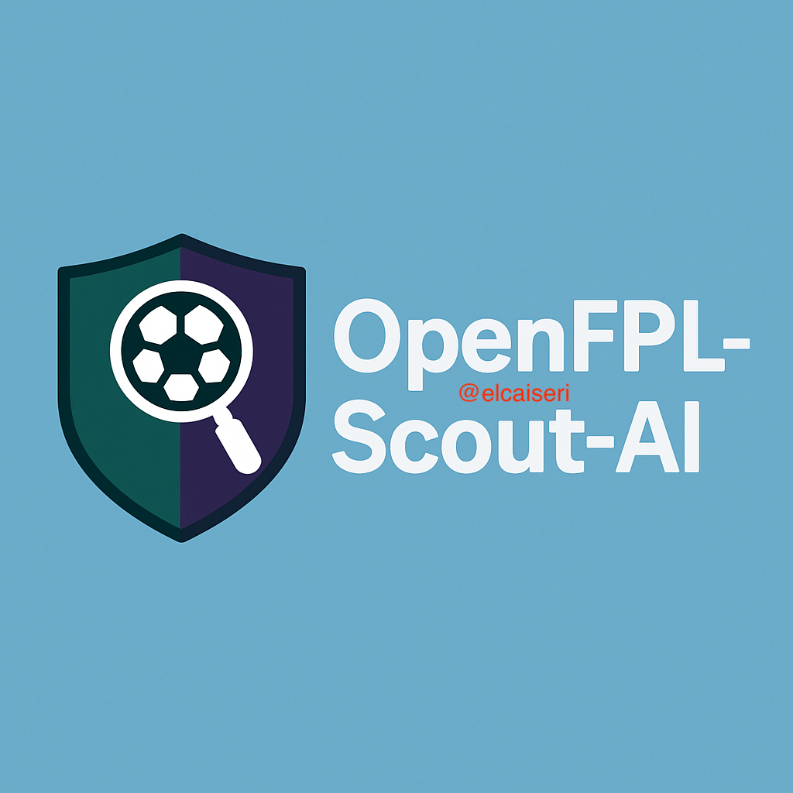

# OpenFPL-Scout-AI



*Image credits: Generated with GPT-4o*

**OpenFPL-Scout-AI** is an AI-powered Fantasy Premier League (FPL) scout that uses an ensemble of machine learning models (Linear Regression, XGBoost, CatBoost) to predict player points and build your optimal FPL squad each gameweek.

## 🚀 Live Demo & API Access

| | Link |
|---|---|
| **Web Interface** | [https://openfpl-scout-ai-186049008266.europe-west1.run.app](https://openfpl-scout-ai-186049008266.europe-west1.run.app) |
| **RapidAPI** | [Subscribe on RapidAPI Marketplace](https://rapidapi.com/elcaiseri-elcaiseri-default/api/openfpl-api) – free tier: 10 req/hr |

## Features

- 🎯 **AI Predictions** – Ensemble ML models (Linear Regression, XGBoost, CatBoost)
- ⚽ **Pitch Visualization** – Interactive football-pitch team layout
- 🏆 **Smart Selection** – Optimal team + captain/vice-captain assignment
- 📊 **Live Data** – Real-time fixtures and match data
- 📱 **Mobile Responsive** – Works on all screen sizes
- 📸 **PNG Export** – Download your lineup as an image
- 🔌 **RapidAPI** – Production-ready API marketplace integration

## Installation

**Docker:**
```bash
docker build -t openfpl-scout-ai .
docker run -d -p 8000:8000 --name openfpl-api openfpl-scout-ai
```

## API

**Base URL:** `https://openfpl-api.p.rapidapi.com`

**Authentication (RapidAPI):**
```http
X-RapidAPI-Key: YOUR_RAPIDAPI_KEY
X-RapidAPI-Host: openfpl-api.p.rapidapi.com
```

### Endpoints

| Method | Path | Description |
|--------|------|-------------|
| GET | `/api/health` | Health check |
| GET | `/api/gameweeks` | Available gameweeks |
| GET | `/api/gw/scout` | Optimal FPL team for a gameweek |
| GET | `/api/gw/playerpoints` | Filtered player point predictions |
| GET | `/api` | API info and metadata |

**Quick Example:**
```javascript
fetch('https://openfpl-api.p.rapidapi.com/api/gw/scout?gameweek=7', {
    headers: {
        'X-RapidAPI-Key': 'YOUR_RAPIDAPI_KEY',
        'X-RapidAPI-Host': 'openfpl-api.p.rapidapi.com'
    }
}).then(r => r.json()).then(console.log);
```

Full docs: [RapidAPI Marketplace](https://rapidapi.com/elcaiseri-elcaiseri-default/api/openfpl-api)

## Screenshots


The pitch layout shows players in formation with color-coded positions (GK orange, DEF blue, MID light-blue, FWD green), captain/vice-captain badges, AI-predicted points, and fixture information.

## ML Models

| Model             | Version | Notes |
|-------------------|---------|-------|
| Linear Regression | v4.0    | Baseline |
| XGBoost           | v4.0    | Gradient boosting |
| CatBoost          | v3.0    | Handles categorical features |

## Code Structure

- `main.py` – FastAPI app and route handlers
- `src/scout.py` – FPLScout (predictions & team selection)
- `src/models.py` – Pydantic response models
- `src/utils.py` – Config and helpers
- `src/logger.py` – Logging

## What's New

- **RapidAPI Marketplace** – Professional API access with free tier
- **New endpoints** – Gameweeks listing and player filtering
- **Live deployment** – Google Cloud Platform
- **Web UI** – Interactive pitch visualization + PNG export
- **2024/2025 models** – CatBoost added; latest season data ([#1](https://github.com/elcaiseri/Fantasy-Premier-League-LTX/issues/1))

## Contributing

Contributions welcome! Fork, branch, and open a pull request.
Ideas: improved algorithms, UI features, injury/form tracking, mobile app.

## License

MIT – see [LICENSE](LICENSE).

## Contact

- **API support / RapidAPI:** [https://rapidapi.com/elcaiseri-elcaiseri-default/api/openfpl-api](https://rapidapi.com/elcaiseri-elcaiseri-default/api/openfpl-api)
- **Email:** [iqasem4444@gmail.com](mailto:iqasem4444@gmail.com)
